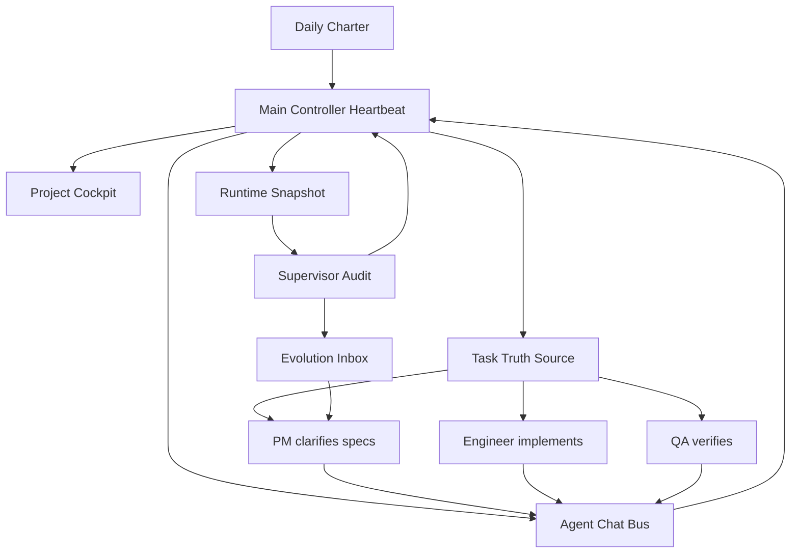

# Lobster Perpetual Machine

> An open-source operating framework for AI agent teams that plan, collaborate, verify, and improve continuously.

[中文 README](README.md) | [Installation Guide](docs/installation.en.md)

Lobster Perpetual Machine is not just a bunch of agents chatting with each other. It turns an AI team into an operating system with a controller, daily planning, product management, engineering, QA, supervision, async agent threads, a task truth source, runtime snapshots, and an evolution inbox.

The goal is to make agents work like a real team: plan first, assign clearly, execute with evidence, verify from a user perspective, and improve the system after each loop.

## What It Solves

Many agent systems fail in predictable ways:

- They keep running but produce little real value.
- They report status instead of making decisions.
- One agent asks another for help, but the message is lost in another session.
- Tasks are too vague to implement or verify.
- There is no product manager, no QA gate, and no supervisor.
- The system becomes complex, but nobody checks whether it is actually getting better.

Lobster Perpetual Machine focuses on these operating-system problems, not just prompt wording.

## Core Concepts

| Concept | Purpose |
|---|---|
| Main Controller | Owns focus, dispatch, decisions, blockers, and value judgment. |
| Daily Charter | Defines today’s goals, deliverables, owners, risks, and acceptance gates. |
| Project Cockpit | Keeps agents aligned around one project object instead of scattered tasks. |
| Task Truth Source | Every task must have owner, next action, acceptance criteria, and evidence. |
| Agent Chat Bus | Each core agent reads its mailbox every heartbeat and writes back status. |
| Heartbeat Protocol | Recurring wakeups must produce action, correction, verification, or learning. |
| Supervisor | Audits system health, real output, communication, and drift. |
| Evolution Inbox | Screens external practices and local lessons before promoting them into tasks. |

## Quick Start

Run directly from GitHub:

```bash
npx github:xianzhen2008-dotcom/lobster-perpetual-machine init
```

Or clone and run locally:

```bash
git clone https://github.com/xianzhen2008-dotcom/lobster-perpetual-machine.git
cd lobster-perpetual-machine
npm install
npm run init
```

Generate a default workspace without prompts:

```bash
npm run demo
```

For a complete setup guide, see [Installation Guide](docs/installation.en.md).

## What the Starter Configures

The starter wizard helps you choose:

- Which agent roles to enable.
- What each role is called and responsible for.
- Heartbeat intervals for controller, planner, PM, engineer, QA, and supervisor.
- Whether to enable task system, agent chat bus, evolution inbox, project cockpit, runtime snapshot, and cron hints.
- Where to generate the workspace.

## Generated Workspace

```text
workspace/
  config/lpm.config.json
  prompts/
    main.md
    planner.md
    pm.md
    dev.md
    qa.md
    supervisor.md
  memory/runtime/
    OPS-SNAPSHOT.md
    HEARTBEAT-DIFF.md
  agent-chat/
    mailboxes/
    threads/
  tasks/
    todo.json
    PROJECT-COCKPIT.md
  evolution/
    EVOLUTION-INBOX.md
  docs/
    OPERATING-RULES.md
```

## Operating Loop



## Design Principles

- A heartbeat is not alive unless it changes something verifiable.
- No task enters execution without owner, next action, acceptance criteria, and evidence.
- The controller decides by default; humans are escalated only for physical, legal, financial, credential, or destructive external actions.
- Agent communication is thread-based. Push messages are reminders, not the truth source.
- The supervisor audits value, not just uptime.
- Evolution candidates must pass value screening before becoming tasks.

## Documentation

- [Installation Guide](docs/installation.en.md)
- [Architecture](docs/architecture.md)
- [Roles and Heartbeats](docs/roles-and-heartbeats.md)
- [Task System](docs/task-system.md)
- [Agent Chat Bus](docs/agent-chat-bus.md)
- [Evolution System](docs/evolution-system.md)
- [Privacy and Safety](docs/privacy-and-safety.md)

## Privacy

This repository is a sanitized public template. Do not commit:

- API keys, tokens, cookies, auth states, or databases.
- Real business data, customer data, emails, or enterprise chat content.
- Private persona files, personal memories, or sensitive task records.

Use `.env` or your own secret manager for credentials.

## One-Liner

Lobster Perpetual Machine is an AI team operating system that turns scattered agents into a goal-driven, evidence-based, self-improving delivery loop.
