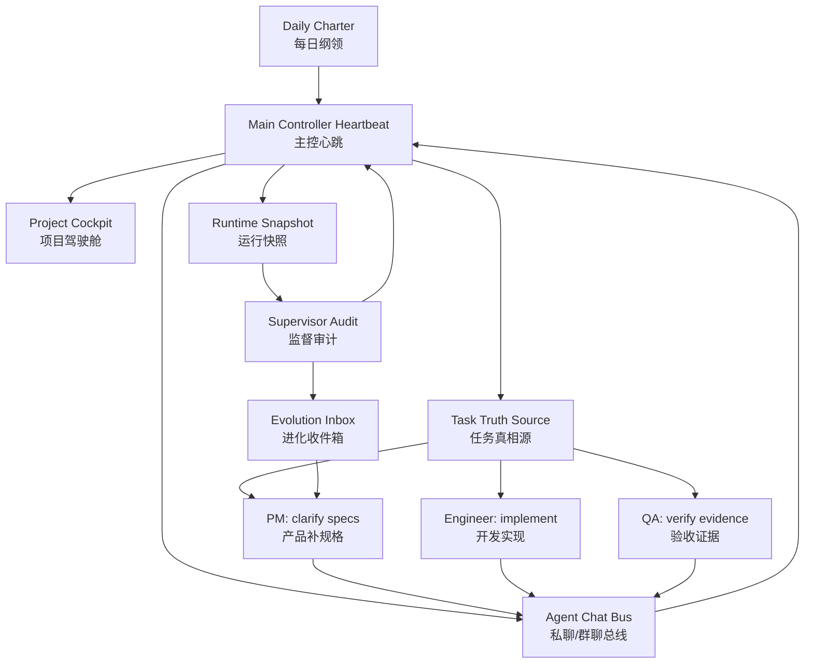

# 龙虾永动机 · Lobster Perpetual Machine

> A self-driving operating system for AI agent teams.  
> 一套让 AI Agent 团队有组织、有节奏、有验收地持续产出的开源运行框架。

龙虾永动机不是“多开几个 agent 聊天”。它把一个 AI 团队拆成可治理的组织系统：主控、计划、产品、开发、验收、监督、异步私聊、任务真相源、运行快照和自我进化队列。目标是让 agent 像真实团队一样工作：先定目标，再分工执行，最后用证据验收和复盘。

Lobster Perpetual Machine is not just a bunch of agents talking to each other. It is an operating model for autonomous AI teams: controller, planner, product, engineering, QA, supervisor, async communication bus, task truth source, runtime snapshots, and an evolution inbox. The goal is to make agents work like a real team: plan, assign, execute, verify, and improve.

## Why

Most agent systems fail in the same way:

- They keep “running” but do not produce value.
- They report status instead of making decisions.
- One agent asks another agent for help, but the message is lost in a different session.
- Tasks are too vague to implement or verify.
- The system has no product manager, no QA gate, and no supervisor.

龙虾永动机解决的是这些组织问题，而不是只解决 prompt 问题。

## Core Concepts

| Concept | English | 中文说明 |
|---|---|---|
| Main Controller | The team captain that owns direction, decisions, dispatch, and escalation. | 主控：抓主线、拍板、派活、处理卡点。 |
| Daily Charter | A daily operating plan with goals, gates, owners, and deliverables. | 每日纲领：当天要达成什么、谁负责、怎么验收。 |
| Project Cockpit | A project-level dashboard for phase, user problem, defects, owner, and evidence. | 项目驾驶舱：让团队围绕一个产品对象推进，而不是散点任务。 |
| Task Truth Source | A structured task pool. Every task must have owner, next action, acceptance criteria, and evidence. | 任务真相源：任务必须可执行、可验收、可追踪。 |
| Agent Chat Bus | Persistent DM/group threads. Every heartbeat must read inbox and write back status. | Agent 私聊总线：解决“发了但对方没看到”的不同频问题。 |
| Heartbeat | Recurring role-specific wakeup protocol. A heartbeat must produce an action, decision, correction, or evidence. | 心跳：不是报平安，而是推进、纠偏、验收或沉淀。 |
| Supervisor | A governance role that audits health, output value, communication, and drift. | 监督官：检查系统是否健康、是否真实产出、是否偏航。 |
| Evolution Inbox | A safe queue for system improvement candidates before they become tasks. | 进化收件箱：把外部方案和本地经验变成可验证升级。 |

## Quick Start

```bash
npx lobster-perpetual-machine init
```

Or clone and run locally:

```bash
git clone https://github.com/xianzhen2008-dotcom/lobster-perpetual-machine.git
cd lobster-perpetual-machine
npm install
npm run init
```

The starter asks:

- Which roles you want to enable.
- What each role is responsible for.
- Heartbeat intervals for controller, planner, PM, engineer, QA, and supervisor.
- Whether to enable the task system, agent chat bus, evolution inbox, project cockpit, and cron hints.
- Where to generate your workspace.

启动程序会引导你配置：

- 要启用哪些 agent 角色。
- 每个角色负责什么。
- 主控、规划、产品、开发、验收、监督的心跳频率。
- 是否开启任务系统、Agent 私聊总线、进化收件箱、项目驾驶舱、cron 提示。
- 要把工作区生成到哪里。

## What Gets Generated

```text
workspace/
  config/lpm.config.json
  prompts/
    main-controller.md
    planner.md
    product-manager.md
    engineer.md
    qa.md
    supervisor.md
  memory/runtime/
    OPS-SNAPSHOT.md
    HEARTBEAT-DIFF.md
  agent-chat/
    mailboxes/
    threads/
  tasks/
    todo.json
    PROJECT-COCKPIT.md
  evolution/
    EVOLUTION-INBOX.md
  docs/
    OPERATING-RULES.md
```

## Operating Loop



## Design Principles

- A heartbeat is not alive unless it changes something verifiable.
- No task enters execution without owner, next action, acceptance criteria, and evidence path.
- The controller decides; it does not wait for the human unless the issue is physical, legal, financial, credential-related, or externally destructive.
- Agent communication is thread-based. Push messages are acceleration, not the truth source.
- Supervisor audits value, not just uptime.
- Evolution candidates must pass value screening before becoming tasks.

## Privacy

This repository is a sanitized public template. Do not commit:

- API keys, tokens, cookies, auth states, database files, private chat logs.
- Real business data, customer data, email content, enterprise chat content.
- Private persona files or memory files containing personal information.

Use `.env` or your local secret manager for credentials.

## Documentation

- [Architecture](docs/architecture.md)
- [Roles and Heartbeats](docs/roles-and-heartbeats.md)
- [Task System](docs/task-system.md)
- [Agent Chat Bus](docs/agent-chat-bus.md)
- [Evolution System](docs/evolution-system.md)
- [Starter Guide](docs/starter-guide.md)

## 中文一句话

龙虾永动机是一套“AI 团队操作系统”：让 agent 不再空转，不再各聊各的，而是围绕明确目标、项目驾驶舱、任务真相源和验收证据持续协作。

## English One-Liner

Lobster Perpetual Machine is an AI team operating system that turns scattered agents into a goal-driven, evidence-based, self-improving delivery loop.
