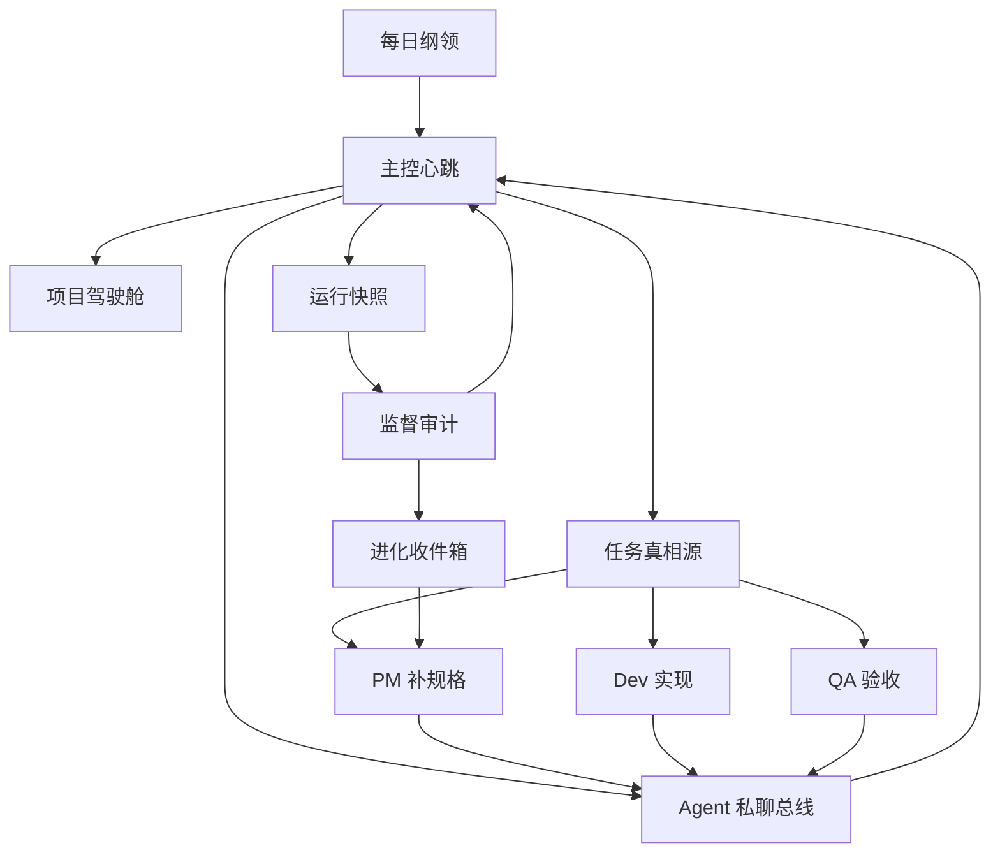

# 龙虾永动机

> 让 AI Agent 团队有组织、有节奏、有验收地持续产出的开源运行框架。

[English README](README.en.md) | [安装与配置教程](docs/installation.zh-CN.md)

龙虾永动机不是“多开几个 agent 聊天”。它把一个 AI 团队拆成可治理的组织系统：主控、每日规划、产品、开发、验收、监督、异步私聊、任务真相源、运行快照和自我进化队列。目标是让 agent 像真实团队一样工作：先定目标，再分工执行，最后用证据验收和复盘。

## 它解决什么问题

很多 Agent 系统会进入一种很熟悉的坏状态：

- 看起来一直在运行，但没有真实产出。
- 汇报很多状态，却没有做决策。
- A 找 B 协作，但消息进入了错误会话，B 下轮根本没读到。
- 任务只有一句话，无法开发、无法验收。
- 没有产品经理、没有 QA 门禁、没有监督官。
- 系统越来越复杂，但没人判断它是否真的变强。

龙虾永动机解决的是这些“组织机制问题”，不是只给你一段更长的 prompt。

## 核心概念

| 概念 | 作用 |
|---|---|
| 主控 | 抓主线、拍板、派活、处理卡点，像团队总导演。 |
| 每日纲领 | 每天先定目标、交付物、责任人、风险和验收标准。 |
| 项目驾驶舱 | 让团队围绕一个项目对象推进，而不是散点任务。 |
| 任务真相源 | 所有任务必须有 owner、next_action、验收标准和证据。 |
| Agent 私聊总线 | 每个核心 agent 每轮先读收件箱，处理后写回状态。 |
| 心跳协议 | 定时唤醒不是报平安，而是推进、纠偏、验收或沉淀。 |
| 监督官 | 审计系统健康、真实产出、沟通链路和偏航风险。 |
| 进化收件箱 | 外部成熟方案和本地经验先筛选，再升级为任务。 |

## 快速开始

直接从 GitHub 运行：

```bash
npx github:xianzhen2008-dotcom/lobster-perpetual-machine init
```

或克隆到本地运行：

```bash
git clone https://github.com/xianzhen2008-dotcom/lobster-perpetual-machine.git
cd lobster-perpetual-machine
npm install
npm run init
```

如果你想无交互生成默认工作区：

```bash
npm run demo
```

更完整的安装、配置、接入说明请看：[安装与配置教程](docs/installation.zh-CN.md)。

## 初始化向导会问什么

启动程序会引导你配置：

- 要启用哪些 agent 角色。
- 每个角色叫什么、负责什么。
- 主控、规划、产品、开发、验收、监督的心跳频率。
- 是否开启任务系统、Agent 私聊总线、进化收件箱、项目驾驶舱、运行快照、OpenClaw 原生 cron 定时。
- 要把工作区生成到哪里。

## 生成的工作区结构

```text
workspace/
  config/lpm.config.json
  prompts/
    main.md
    planner.md
    pm.md
    dev.md
    qa.md
    supervisor.md
  memory/runtime/
    OPS-SNAPSHOT.md
    HEARTBEAT-DIFF.md
  agent-chat/
    mailboxes/
    threads/
  muse/
    README.md
    TASK-LIFECYCLE.md
  scheduler/
    openclaw-cron-jobs.json
    heartbeat-plan.cron
    README.md
  tasks/
    todo.json
    PROJECT-COCKPIT.md
  evolution/
    EVOLUTION-INBOX.md
  docs/
    OPERATING-RULES.md
```

心跳优先走 OpenClaw 原生 cron。初始化向导会问你是否现在自动部署到 OpenClaw；如果暂不部署，也会生成 `scheduler/openclaw-cron-jobs.json`，后续可执行：

```bash
npx lobster-pm install-scheduler --dir ./workspace --mode openclaw-cron --confirm
```

本地体验不需要真实 OpenClaw，可以先跑模拟：

```bash
npx lobster-pm doctor --dir ./workspace
npx lobster-pm demo-loop --dir ./workspace --rounds 1
npx lobster-pm tick --dir ./workspace --role main
```

`muse/README.md` 会随工作区生成，说明开源版的 Muse 兼容任务底座就是 `tasks/todo.json`，避免新人误建第二套任务源。
`muse/TASK-LIFECYCLE.md` 会写清任务的写入、读取、接单、提交验收、完成/打回和归档链路。

## 运行逻辑



## 设计原则

- 心跳不是活着，心跳必须改变一些可验证的东西。
- 没有 owner、next_action、acceptance criteria、evidence 的任务不能进入执行。
- 主控默认自己决策，只有物理、法律、财务、密钥、外部破坏性动作才上收人类。
- Agent 沟通必须线程化，push 只是提醒，不是真相源。
- 监督官审计价值，不只审计 uptime。
- 进化候选必须先经过价值筛选，不能直接污染任务池。

## 文档

- [安装与配置教程](docs/installation.zh-CN.md)
- [架构说明](docs/architecture.md)
- [角色与心跳](docs/roles-and-heartbeats.md)
- [任务系统](docs/task-system.md)
- [Agent 私聊总线](docs/agent-chat-bus.md)
- [进化系统](docs/evolution-system.md)
- [隐私与安全](docs/privacy-and-safety.md)

## 隐私边界

这个仓库是脱敏后的公开模板。不要提交：

- API key、token、cookie、认证状态、数据库。
- 真实业务数据、客户数据、邮件、企业聊天内容。
- 私人人格设定、个人记忆、私密任务记录。

凭证请放在 `.env` 或你自己的密钥管理系统里。

## 一句话

龙虾永动机是一套“AI 团队操作系统”：让 agent 不再空转，不再各聊各的，而是围绕明确目标、项目驾驶舱、任务真相源和验收证据持续协作。
