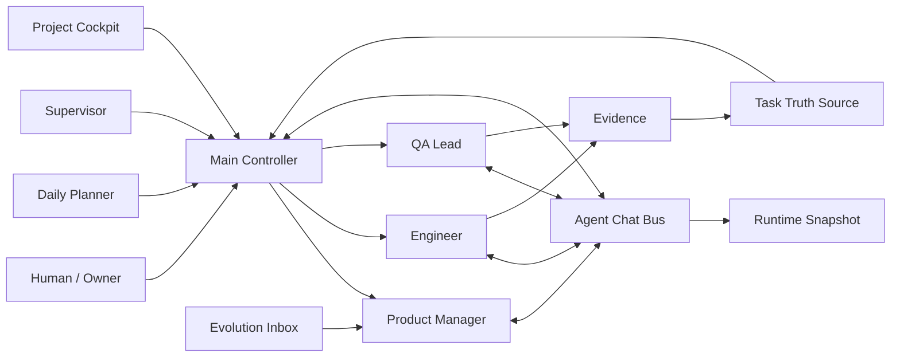

# Architecture / 架构

## English

Lobster Perpetual Machine is a layered operating system for AI agent teams.

### Layers

1. **Control Layer**: the main controller, planner, and supervisor.
2. **Execution Layer**: PM, engineer, QA, and optional specialists.
3. **Truth Layer**: task source, project cockpit, runtime snapshot, evidence records.
4. **Communication Layer**: persistent agent DMs and group threads.
5. **Evolution Layer**: external patterns, local lessons, and improvement candidates.

The key architectural choice is that long-term agent identity and judgment live in stable role sessions, while noisy execution can be delegated to temporary workers. The truth is not in chat memory; it is in structured files or APIs.

## 中文

龙虾永动机是一套分层的 AI 团队操作系统。

### 五层结构

1. **控制层**：主控、每日规划、监督官。
2. **执行层**：产品、开发、验收，以及按需专家。
3. **真相层**：任务源、项目驾驶舱、运行快照、证据记录。
4. **沟通层**：长期私聊和多人线程。
5. **进化层**：外部成熟方案、本地经验、系统升级候选。

核心设计取舍是：长期岗位脑负责连续判断，临时执行可以下沉到隔离 worker；系统真相不放在聊天记忆里，而放在结构化文件或 API 中。

## Non-Goals / 非目标

- This is not a replacement for your LLM runtime.
- This is not a single-agent prompt.
- This is not an auto-click bot for private business systems.
- This is not a guarantee that agents are correct; QA gates still matter.

它不是大模型运行时、不是单 agent prompt、不是业务系统自动点击器，也不保证 agent 永远正确。它提供的是组织机制和质量闭环。
