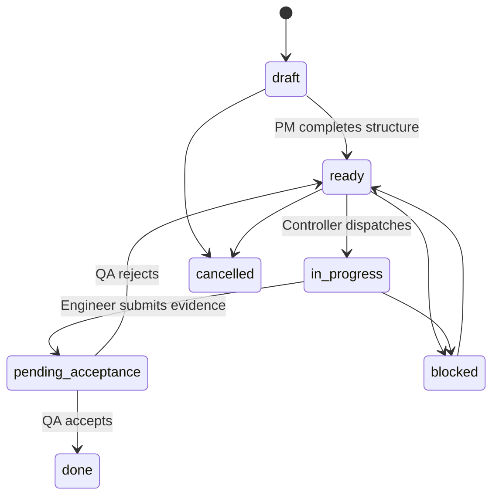

# Task System / 任务系统

## Required Fields

Every executable task should contain:

- `id`
- `title`
- `status`
- `owner`
- `project_id`
- `project_phase`
- `user_problem`
- `target_outcome`
- `next_action`
- `acceptance_criteria`
- `evidence`
- `last_activity_at`
- `last_actor`

## Status Flow

## 中文说明

一句话任务不能直接进入开发。它必须先由产品角色补齐：

- 为什么做。
- 做到什么程度算完成。
- 谁负责。
- 下一步是什么。
- 验收看什么。
- 证据放哪里。

如果没有这些字段，agent 只能写长篇分析，无法像团队一样交付。

## Quality Gates

- **Intake -> Design**: user problem, success picture, non-goals.
- **Design -> Build**: PRD/spec, smallest usable path, acceptance criteria.
- **Build -> QA**: runnable artifact, change summary, evidence.
- **QA -> Release**: user journey passes.
- **Release -> Improve**: next improvement is selected.
