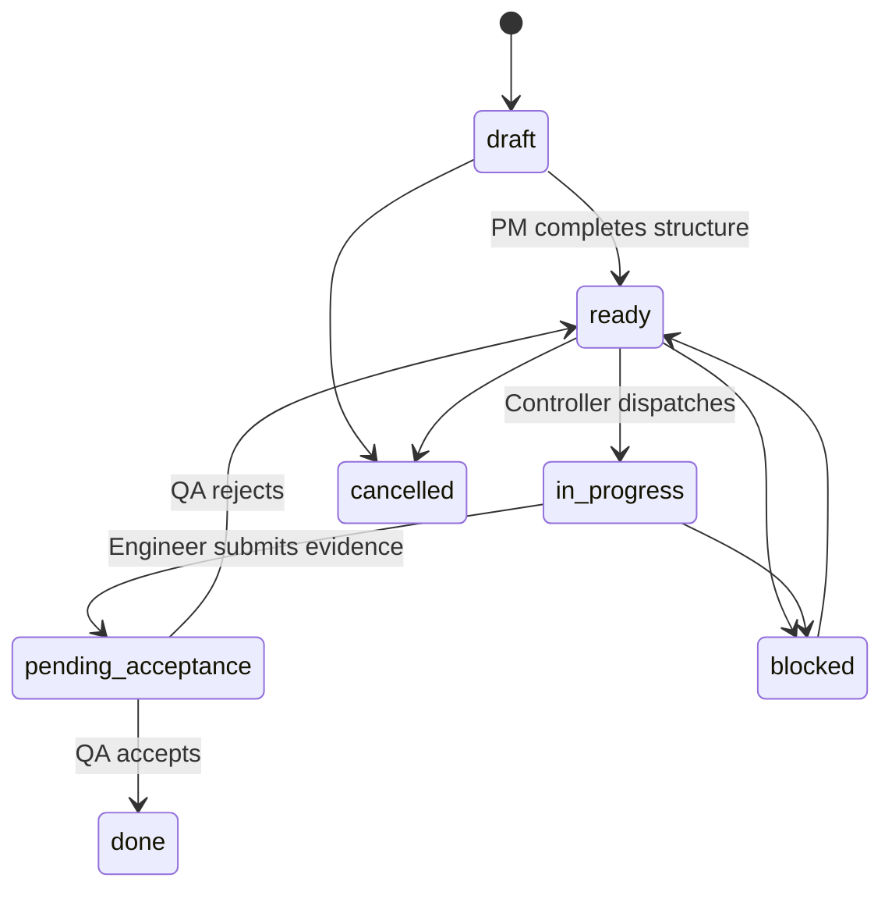

# Task System / 任务系统

## Required Fields

Every executable task should contain:

- `id`
- `title`
- `status`
- `owner`
- `project_id`
- `project_phase`
- `user_problem`
- `target_outcome`
- `next_action`
- `acceptance_criteria`
- `evidence`
- `last_activity_at`
- `last_actor`

## Status Flow

## 中文说明

一句话任务不能直接进入开发。它必须先由产品角色补齐：

- 为什么做。
- 做到什么程度算完成。
- 谁负责。
- 下一步是什么。
- 验收看什么。
- 证据放哪里。

如果没有这些字段，agent 只能写长篇分析，无法像团队一样交付。

## Muse 操作链路

开源版默认把 `tasks/todo.json` 作为 Muse 兼容任务真相源。生成工作区后还会创建 `muse/TASK-LIFECYCLE.md`，作为 agent 每轮读写任务的正式规则。

- 写入任务：用户一句话、主控派单、PM 结构化、监督纠偏、进化候选都可以进入 `draft`，但必须补齐 owner、next_action、acceptance_criteria 和 evidence 位置。
- 读取任务：每轮心跳先读 `tasks/todo.json`，再按 `blocked`、`pending_acceptance`、`in_progress`、`ready`、`draft` 顺序判断。
- 接单任务：只有 `ready` 能进入 `in_progress`，接单人必须写 started_at、last_actor、next_action 和预期证据。
- 提交任务：实现完成后进入 `pending_acceptance`，必须带 submitted_at、evidence 和 acceptance_note。
- 完成任务：QA 通过后写 accepted_at、accepted_by、acceptance_note，状态改为 `done`。
- 打回任务：QA 不通过时写 rejected_at、rejected_by、rejection_reason 和新的 next_action，状态回到 `ready`。

## Quality Gates

- **Intake -> Design**: user problem, success picture, non-goals.
- **Design -> Build**: PRD/spec, smallest usable path, acceptance criteria.
- **Build -> QA**: runnable artifact, change summary, evidence.
- **QA -> Release**: user journey passes.
- **Release -> Improve**: next improvement is selected.
